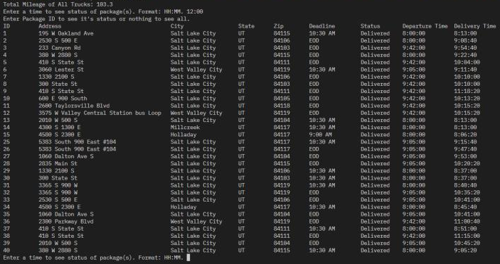
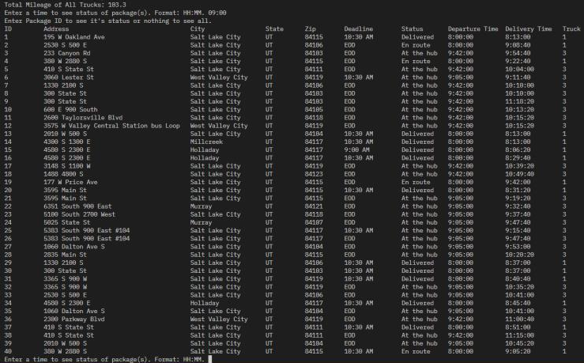
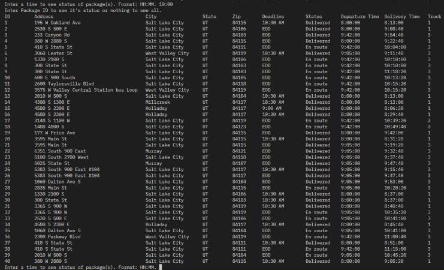
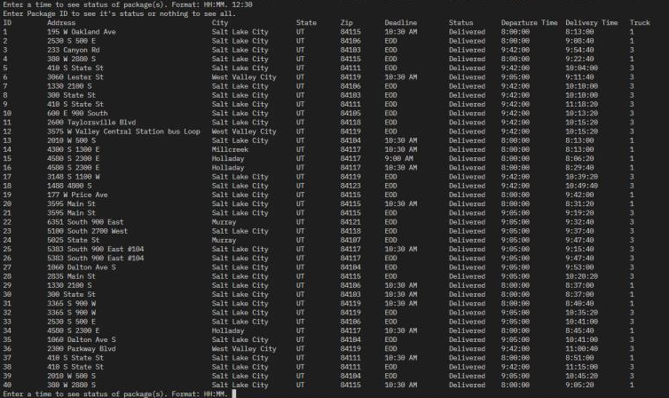

# Package Delivery Network System

The Package Delivery Network System is an innovative solution tailored for the Parcel Service's local delivery operations, employing a greedy nearest neighbor algorithm and a custom hash table to ensure efficient and timely package deliveries within a specific mileage limit.

## Table of Contents

- [Features](#features)
- [Languages Used](#languages-used)
- [Usage](#usage)
- [License](#license)

## Features

- **Intelligent Routing Algorithm:** Utilizes a greedy nearest neighbor algorithm to optimize delivery routes under 140 miles, guaranteeing timely package arrivals.
- **Optimized for Scalability:** The system is tailored for Salt Lake City but can be easily modified for use in other locales.
- **User-Friendly Interface:** Offers a CLI for real-time access to delivery statuses and total mileage, enhancing operational efficiency and oversight.

## Languages Used

- **Python**

## Usage

- **View Package Status:** Utilize the CLI to check a package's delivery status, including its delivery time, by inputting the package ID.
- **Monitor Delivery Progress:** The system shows the total mileage covered by all trucks and allows for real-time tracking of delivery progress by entering a specific time.

### Example: Checking at 09:00

### Example: Checking at 10:00

### Example: Checking at 12:30

## License

[MIT License](LICENSE)
